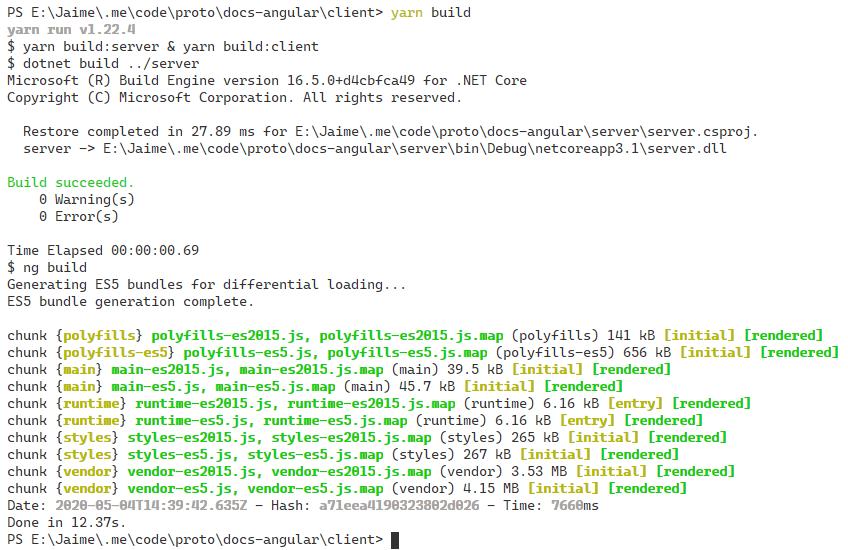

# Disconnected Docs

* [Overview](#overview)
* [Relevant Files](#relevant-files)
* [Getting Started](#getting-started)

## Overview
[Back to Top](#disconnected-docs)

This repository is a work in progress with the intent of breaking ways with the practice of integrating a SPA front end with a .NET Core back end.

The application works by providing a means of enumerating all markdown-related resources from a directory (in this case, [wwwroot](./server/wwwroot)), and rendering the contents of a markdown document when one is selected.

[](./.images/app.png)  

## Relevant Files
[Back to Top](#disconnected-docs)

**server**

> The app is setup to read directly from [wwwroot](./server/wwwroot), but can be configured for blob storage from anywhere.

* [Models/Document.cs](./server/Models/Document.cs)
* [Models/Folder.cs](./server/Models/Folder.cs)
* [Extensions/DocumentExtensions.cs](./server/Extensions/DocumentExtensions.cs)
    * Note recursion in the `GetFolder` method
* [Controllers/DocumentController.cs](./server/Controllers/DocumentController.cs)

**client**

* [services/marked.service.ts](./client/src/app/services/marked.service.ts)
* [services/content.service.ts](./client/src/app/services/content.service.ts)
* [components/folder.component.ts](./client/src/app/components/folder.component.ts)
* [routes/home/home.component.ts](./client/src/app/routes/home/home.component.ts)

## Getting Started
[Back to Top](#disconnected-docs)

The `client` directory contains all of the necessary `build` and `start` scripts in [client/package.json](./client/package.json).

In order to build both the server and client at the same time, all you need to do is change directory to `./client` and execute:

```bash
yarn build
```

[](./.images/yarn-build.png)

In order to run both the server and client at the same time, all you need to do is change directory to `./client` and execute:

```bash
yarn start
```

[](./.images/yarn-start.png)

You can now navigate to the client app at [localhost:4200](http://localhost:4200), or check out server resources at [localhost:5000/api/document/getBaseFolder](http://localhost:5000/api/document/getBaseFolder)