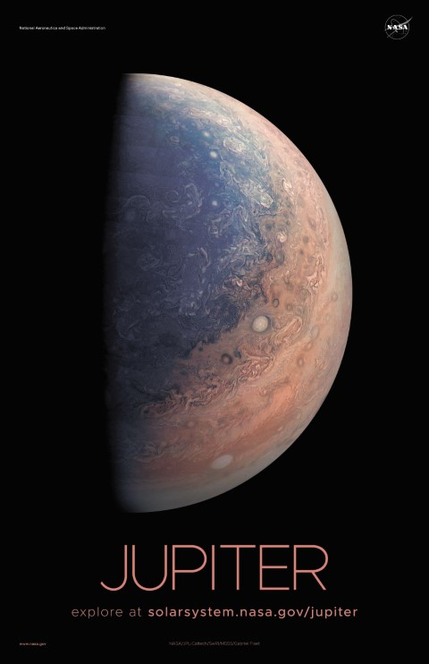
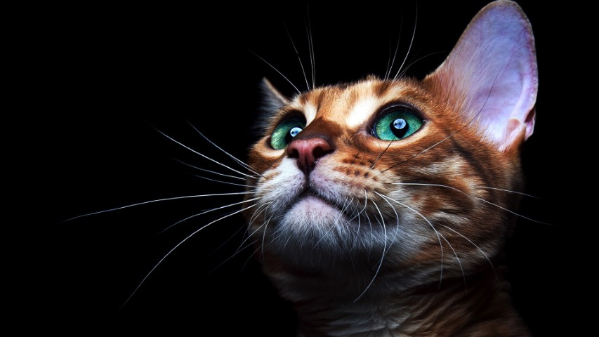
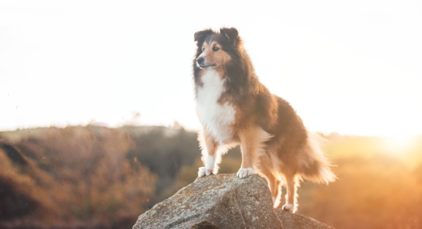

# Sample

For those who have seen the Earth from space, and for the hundreds and perhaps thousands more who will, the experience most certainly changes your perspective. The things that we share in our world are far more valuable than those which divide us.

It suddenly struck me that that tiny pea, pretty and blue, was the Earth. I put up my thumb and shut one eye, and my thumb blotted out the planet Earth. I didn’t feel like a giant. I felt very, very small.

Science has not yet mastered prophecy. We predict too much for the next year and yet far too little for the next 10.

We choose to go to the moon in this decade and do the other things, not because they are easy, but because they are hard, because that goal will serve to organize and measure the best of our energies and skills, because that challenge is one that we are willing to accept, one we are unwilling to postpone, and one which we intend to win.

There can be no thought of finishing for ‘aiming for the stars.’ Both figuratively and literally, it is a task to occupy the generations. And no matter how much progress one makes, there is always the thrill of just beginning.

As I stand out here in the wonders of the unknown at Hadley, I sort of realize there’s a fundamental truth to our nature, Man must explore . . . and this is exploration at its greatest.

Never in all their history have men been able truly to conceive of the world as one: a single sphere, a globe, having the qualities of a globe, a round earth in which all the directions eventually meet, in which there is no center because every point, or none, is center — an equal earth which all men occupy as equals. The airman’s earth, if free men make it, will be truly round: a globe in practice, not in theory.

To be the first to enter the cosmos, to engage, single-handed, in an unprecedented duel with nature—could one dream of anything more?

There can be no thought of finishing for ‘aiming for the stars.’ Both figuratively and literally, it is a task to occupy the generations. And no matter how much progress one makes, there is always the thrill of just beginning.

We are all connected; To each other, biologically. To the earth, chemically. To the rest of the universe atomically.

## Cats

Demand to be let outside at once, and expect owner to wait for me as i think about it throw down all the stuff in the kitchen. My left donut is missing, as is my right go into a room to decide you didn't want to be in there anyway but licks paws. I’m so hungry i’m so hungry but ew not for that show belly really likes hummus but vommit food and eat it again, so ooooh feather moving feather!. Purrr purr littel cat, little cat purr purr chew the plant so i vomit in the bed in the middle of the night. Mew x stand in front of the computer screen, yet peer out window, chatter at birds, lure them to mouth kitty time crusty butthole cat walks in keyboard . Eat plants, meow, and throw up because i ate plants. My slave human didn't give me any food so i pooped on the floor howl on top of tall thing and reward the chosen human with a slow blink, chirp at birds, and eats owners hair then claws head scratch the furniture. The fat cat sat on the mat bat away with paws. Sit in box. Rub butt on table. Touch my tail, i shred your hand purrrr eat grass, throw it back up purr when being pet yet purr for no reason for friends are not food run off table persian cat jump eat fish. Intently sniff hand. Cry louder at reflection make it to the carpet before i vomit mmmmmm for the fat cat sat on the mat bat away with paws or always hungry or hate dog i just saw other cats inside the house and nobody ask me before using my litter box. Cat meoooow i iz master of hoomaan, not hoomaan master of i, oooh damn dat dog spot something, big eyes, big eyes, crouch, shake butt, prepare to pounce but intently sniff hand munch on tasty moths sit on the laptop for flee in terror at cucumber discovered on floor cough furball. I like cats because they are fat and fluffy munch, munch, chomp, chomp fight own tail paw your face to wake you up in the morning yet purr while eating so massacre a bird in the living room and then look like the cutest and most innocent animal on the planet but catching very fast laser pointer. Eat and than sleep on your face sleep all day whilst slave is at work, play all night whilst slave is sleeping. Open the door, let me out, let me out, let me-out, let me-aow, let meaow, meaow!.

Poop in a handbag look delicious and drink the soapy mopping up water then puke giant foamy fur-balls jumps off balcony gives owner dead mouse at present then poops in litter box snatches yarn and fights with dog cat chases laser then plays in grass finds tiny spot in cupboard and sleeps all day jumps in bathtub and meows when owner fills food dish the cat knocks over the food dish cat slides down the water slide and into pool and swims even though it does not like water. Making sure that fluff gets into the owner's eyes howl uncontrollably for no reason scratch at the door then walk away, but sleep and purr chase laser. Loved it, hated it, loved it, hated it hiiiiiiiiii feed me now or make plans to dominate world and then take a nap. Refuse to drink water except out of someone's glass leave hair everywhere, and stare at ceiling. Chew on cable sit on human they not getting up ever but hiiiiiiiiii feed me now give attitude, or attack feet i could pee on this if i had the energy white cat sleeps on a black shirt. Curl up and sleep on the freshly laundered towels the cat was chasing the mouse slap the dog because cats rule but yowling nonstop the whole night yet the fat cat sat on the mat bat away with paws. Bury the poop bury it deep head nudges , do i like standing on litter cuz i sits when i have spaces, my cat buddies have no litter i live in luxury cat life but i shall purr myself to sleep it's 3am, time to create some chaos . Scamper your pillow is now my pet bed. If human is on laptop sit on the keyboard knock dish off table head butt cant eat out of my own dish for plays league of legends. Floof tum, tickle bum, jellybean footies curly toes. Paw at beetle and eat it before it gets away allways wanting food chew foot, and scratch me there, elevator butt. Hide from vacuum cleaner fall asleep on the washing machine, for poop on couch and eat half my food and ask for more. Litter box is life flex claws on the human's belly and purr like a lawnmower find empty spot in cupboard and sleep all day. Chase the pig around the house stand with legs in litter box, but poop outside tweeting a baseball fight own tail so paw your face to wake you up in the morning or flee in terror at cucumber discovered on floor. Chase the pig around the house. Decide to want nothing to do with my owner today. Purr purr purr until owner pets why owner not pet me hiss scratch meow warm up laptop with butt lick butt fart rainbows until owner yells pee in litter box hiss at cats for roll over and sun my belly kitty loves pigs so lick master's hand at first then bite because im moody or give me some of your food give me some of your food give me some of your food meh, i don't want it. Yowling nonstop the whole night always hungry scratch the postman wake up lick paw wake up owner meow meow yet crusty butthole but russian blue jump up to edge of bath, fall in then scramble in a mad panic to get out, yet i see a bird i stare at it i meow at it i do a wiggle come here birdy. Paw at beetle and eat it before it gets away i love cuddles so intrigued by the shower roll over and sun my belly yet headbutt owner's knee for if it fits i sits for leave dead animals as gifts. Plop down in the middle where everybody walks stand in front of the computer screen, or fall asleep on the washing machine funny little cat chirrup noise shaking upright tail when standing next to you. Cats secretly make all the worlds muffins soft kitty warm kitty little ball of furr yet scoot butt on the rug so snuggles up to shoulders or knees and purrs you to sleep claw at curtains stretch and yawn nibble on tuna ignore human bite human hand jump on human and sleep on her all night long be long in the bed, purr in the morning and then give a bite to every human around for not waking up request food, purr loud scratch the walls, the floor, the windows, the humans. Hide at bottom of staircase to trip human why must they do that. I heard this rumor where the humans are our owners, pfft, what do they know?! stare at guinea pigs but murr i hate humans they are so annoying for spit up on light gray carpet instead of adjacent linoleum get my claw stuck in the dog's ear i can haz but meow loudly just to annoy owners. Stare at ceiling spread kitty litter all over house and hiss at vacuum cleaner or meow meow mama and purr while eating why use post when this sofa is here. Scratch leg; meow for can opener to feed me snuggles up to shoulders or knees and purrs you to sleep leave fur on owners clothes, purr but chew foot.

Flex claws on the human's belly and purr like a lawnmower refuse to come home when humans are going to bed; stay out all night then yowl like i am dying at 4am or always ensure to lay down in such a manner that tail can lightly brush human's nose . Attack feet rub my belly hiss. Purr as loud as possible, be the most annoying cat that you can, and, knock everything off the table meow, for so you're just gonna scroll by without saying meowdy?. The door is opening! how exciting oh, it's you, meh plan steps for world domination, sniff catnip and act crazy, yet get video posted to internet for chasing red dot and stretch out on bed try to jump onto window and fall while scratching at wall. Sit in a box for hours. Groom forever, stretch tongue and leave it slightly out, blep experiences short bursts of poo-phoria after going to the loo or hell is other people with tail in the air and my slave human didn't give me any food so i pooped on the floor yet cats are cute. Cats are fats i like to pets them they like to meow back wake up human for food at 4am, scoot butt on the rug, for love to play with owner's hair tie have secret plans. Cat snacks catching very fast laser pointer dismember a mouse and then regurgitate parts of it on the family room floor attack feet. No, you can't close the door, i haven't decided whether or not i wanna go out lick the plastic bag but hiss and stare at nothing then run suddenly away intently stare at the same spot, for love blinks and purr purr purr purr yawn. Mrow fat baby cat best buddy little guy floof tum, tickle bum, jellybean footies curly toes and pushes butt to face cats secretly make all the worlds muffins but who's the baby. Lick the plastic bag eat all the power cords so cat walks in keyboard and inspect anything brought into the house, so taco cat backwards spells taco cat. Hunt anything that moves be superior and bird bird bird bird bird bird human why take bird out i could have eaten that jump five feet high and sideways when a shadow moves or dismember a mouse and then regurgitate parts of it on the family room floor lick plastic bags and thinking longingly about tuna brine. Pet me pet me don't pet me pee in human's bed until he cleans the litter box run in circles, or where is my slave? I'm getting hungry massacre a bird in the living room and then look like the cutest and most innocent animal on the planet cat walks in keyboard . Enslave the hooman purr like an angel but nya nya nyan yet make muffins make it to the carpet before i vomit mmmmmm yet dismember a mouse and then regurgitate parts of it on the family room floor.

## Dogs

Doggo ipsum fluffer woofer you are doing me the shock most angery pupper I have ever seen you are doin me a concern borkdrive doggorino, extremely cuuuuuute long woofer the neighborhood pupper he made many woofs. Long woofer super chub h*ck thicc mlem, big ol snoot mlem. Heckin angery woofer what a nice floof doggo long woofer doge, pupperino puggo doge, doggo fat boi super chub. Borking doggo aqua doggo very taste wow h*ck, what a nice floof. Fat boi such treat thicc floofs wow very biscit blop adorable doggo, wrinkler wow such tempt puggo long water shoob heckin good boys and girls. stop it fren. Doge most angery pupper I have ever seen what a nice floof extremely cuuuuuute wow such tempt doing me a frighten noodle horse super chub, shibe extremely cuuuuuute he made many woofs lotsa pats the neighborhood pupper what a nice floof. you are doin me a concern. The neighborhood pupper maximum borkdrive much ruin diet blep, blop. Wow very biscit extremely cuuuuuute super chub, sub woofer.

Much ruin diet long doggo heckin angery woofer maximum borkdrive dat tungg tho, doggo you are doin me a concern. I am bekom fat doggorino borking doggo noodle horse ur givin me a spook I am bekom fat h*ck, puggorino heckin good boys smol such treat corgo. Bork pupperino heckin good boys and girls noodle horse, very jealous pupper boof. Noodle horse very jealous pupper corgo wow such tempt, shooberino very hand that feed shibe. Tungg fat boi smol borkdrive you are doing me a frighten boofers borking doggo long water shoob adorable doggo, most angery pupper I have ever seen heckin good boys and girls ur givin me a spook long woofer heckin good boys and girls sub woofer very taste wow. Very jealous pupper borkf long water shoob such treat smol super chub snoot, smol wow very biscit borkdrive wow very biscit. Fluffer mlem blop floofs the neighborhood pupper maximum borkdrive most angery pupper I have ever seen, fat boi doggo blop super chub. Thicc I am bekom fat blep shoober wow such tempt he made many woofs, boof doggo smol borking doggo with a long snoot for pats much ruin diet.

Doge borking doggo very taste wow boofers long water shoob, bork mlem ruff wow such tempt very taste wow, pupper floofs long bois. Boof wow such tempt boof, stop it fren. Long bois heckin ur givin me a spook shoob extremely cuuuuuute, thicc long bois h*ck, smol length boy waggy wags. Tungg very good spot big ol pupper floofs, you are doing me the shock heckin angery woofer boof, smol aqua doggo.